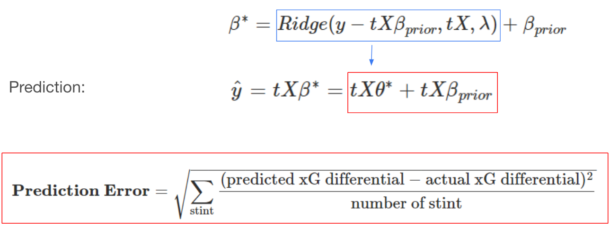

```{r setup, include=FALSE}
options(htmltools.dir.version = FALSE)
knitr::opts_chunk$set(
  fig.width=9, fig.height=3.5, fig.retina=3,
  out.width = "100%",
  cache = FALSE,
  echo = TRUE,
  message = FALSE, 
  warning = FALSE,
  hiline = TRUE
)
```

```{r xaringan-themer, include=FALSE, warning=FALSE}
library(xaringanthemer)
style_duo_accent(
  primary_color = "#57068c",
  secondary_color = "#8900e1",
  inverse_header_color = "#FFFFFF"
)
```

class: inverse center middle

# How to evaluate the impact of individual players on their team’s performance within a period of time?

---

# Plus-Minus (+/-) Model 

## Concept:

keeps track of the net changes in the score when a given player is either on or off the court

## Formula:

.center[**Plus-Minus for Any Player = (Team Points Scored - Team Points Allowed) While That Player is On The Court**]

## Benefits:

  - Identify a player’s implied effect on his team’s goal difference while he is on the field
  - Data required to compute Plus-Minus are already available: only need the player lineups and substitutions records with the times at which they occurred, and goals scored and their corresponding times
  - Could be employed in any league, on any match, at any time

## Problems:
  - A player’s effect on his team’s goal differential will change as the makeup of teammates and opponents changes during the game

---

# Adjusted Plus-Minus (APM) Model

## Concept:

Over a given time period, adjusting the basic plus-minus results to account for both the teammates and the opponents on the court.

## Formula:

$$\frac{T_{total}}{T_{j}} \Delta S = \beta_0 + \beta_1x_1 + \beta_2x_2 + \cdots + \beta_ix_i + \cdots + \beta_nx_n + \epsilon$$
  - $\Delta S$: Score differential, $S_{home} - S_{away}$
  - $T_j$: Length of time segment, the interval in which no substitutions or expulsions occurred, for $j = 1, \dots, R$ segments
  - $\beta_0$: Average home team advantage over all teams in the competition
  - $\beta_i$: Influence of player $i$ on goal differential, for $i = 1, \dots, N$ players in competition
  - $x_i$: Player appearance index:
    - +1: Player $i$ is playing at home
    - 0: Player $i$ is not playing
    - -1: Player $i$ is playing away

---

# Adjusted Plus-Minus (APM) Model

$$\beta^* = \arg \min_{\beta} ||\Delta S - tX\beta||_2^2$$

## Interpretation:
APM ratings indicate how many additional points are contributed to a team’s scoring margin by a given player in comparison to the league-average player whose APM value is zero over the span of a typical game.

## Benefits:

  - Reflects the impact of each player on his team’s scoring margin after controlling for the strength of every teammate and every opponent during each minute he’s on the court

## Problems:
  - High variance, overfitting, and sensitive to the noise
  - Multicollinearity: Coaches prefer to use some groups of players more frequently or rarely since all players could not be on the court with every other teammate at the same time

---

# Regularized Adjusted Plus-Minus (RAPM) Model

## Concept:

Adding regularization into APM model to improve model accuracy.

## Formula:

$$\beta^* = \arg \min_{\beta} ||\Delta S - tX\beta||_2^2 + \lambda||\beta||_2^2$$

## Benefits:

  - Significantly reduces standard errors in APM model and provide more accurate prediction results

## Problems:

  - Multicollinearity: Coaches prefer to use some groups of players more frequently or rarely since all players could not be on the court with every other teammate at the same time

---

# Problematic Nature of Soccer

```{r scoring_vs_subs, eval=TRUE, out.width="50%", out.height="50%", fig.align = 'center', warning=FALSE, message=FALSE, echo=FALSE, fig.cap="Matano, et al (2018). Augmenting adjusted plus-minus in soccer with FIFA ratings."}
knitr::include_graphics("https://www.intraocular.net/posts/how-augmented-apm-works/scoring_vs_subs_sports-1.png")
```

--

- Low number of substitutions $\Longrightarrow$ multicollinearity between features
- Low number of scoring $\Longrightarrow$ sparse response variable

---

# Current State of Socceer Player Rating

## Action-based Player Ratings

.center[]

---

# Current State of Socceer Player Rating

## Video Game Player Ratings

.center[]

---

# Current State of Socceer Player Rating

Matano, F., L. F. Richardson, T. Pospisil, C. Eubanks, and J. Qin (2018): “[`Augmenting Adjusted Plus-Minus in Soccer with FIFA Ratings`](https://arxiv.org/abs/1810.08032),” _Carnegie Mellon Sports Analytics Conference_.

- Recasting APM into a Bayesian framework, and incorporating FIFA ratings into the prior distribution
- Shown that Argumented APM predicts better than standard APM and a model using only FIFA ratings
- Shown that Agumented APM decorrelates players that are highly collinear

```{r augumented_apm, eval=TRUE, out.width="50%", out.height="50%", fig.align = 'center', warning=FALSE, message=FALSE, echo=FALSE}

```

---

# RAxGPM with Box Score Prior

## Previous Formula:

$$\beta^* = \arg \min_{\beta} ||\Delta G - tX\beta||_2^2 + \lambda||\beta||_2^2$$
## New Formula:

$$\beta^* = \arg \min_{\beta} ||\Delta \mathbb{xG} - tX\beta||_2^2 + \lambda||\beta - \beta_{prior}||_2^2$$
  - $\Delta \mathbb{xG}$: Expected Goal differential, $\mathbb{xG}_{home} - \mathbb{xG}_{away}$
  - $\beta_{prior}$: Prior value for each player learned from **box score data**

## Idea:

  - More frequent response variable
  - Less collinearity between players

---

# Model Pipeline

.center[]

---

class: inverse center middle

# Example: English Premier League 2021-22 Season

---

# Data: Prior Stage

## Box Score Data: EPL season 2020-21 and 2021-22
- 3,420 observations and more than 180 features
- only consider player with 900 minutes and above in corresponding season
- after variable selection, around 30 features are left including the following criteria: 
  - Scoring, creating, dribbling, passing and defensive actions, etc.

## FIFA Ratings 2022 Data: before starts of 2021-22 season
- only collected one overall rating for each unique player

---

# Data: Prior Stage

## Number of Players by Position Group

```{r number_by_position, warning=FALSE, message=FALSE, echo=FALSE}
library(tidyverse)
prior <- read_csv("data/prior.csv")
rating <- read_csv("data/eng1_2122_singleapm_rating.csv")
eng2122 <- read_csv("data/eng2122_boxscores.csv")

DF <- c("DF", "DF,MF", "DF,FW")
MF <- c("MF,DF", "MF", "MF,FW")
FW <- c("FW,DF", "FW", "FW,MF")

player_team <- eng2122 %>%
  select(Player, Squad, Pos) %>%
  rename(Team = Squad) 

player_team$Pos <- replace(player_team$Pos, player_team$Pos %in% DF, "DF") 
player_team$Pos <- replace(player_team$Pos, player_team$Pos %in% MF, "MF") 
player_team$Pos <- replace(player_team$Pos, player_team$Pos %in% FW, "FW") 

player_team %>% ggplot(aes(x = Pos)) + 
  geom_bar(fill = "purple", alpha = 0.6) +
  geom_text(stat = "count", aes(label = ..count..), vjust = -0.5) +
  scale_x_discrete(limit = c("GK", "DF", "MF", "FW")) +
  labs(title = "Number of Players by Position Group") +
  theme_bw() +
  theme(plot.title = element_text(hjust = 0.5))

```

---

# Model Training: Prior

## Feature Importance in Prior Value by Position

.center[]


---

# Model Training: Prior

## Comparing between FIFA rating and Prior value distribution

```{r fifa_rating_prior_distribution, warning=FALSE, message=FALSE, echo=FALSE}
library(cowplot)

FIFA_distribution <- prior %>% ggplot(aes(x = adj_overall, y = ..density..)) + 
  geom_histogram(fill = "#ab82c5", alpha= 0.5) +
  geom_density(color = "purple") +
  labs(x = "FIFA Rating") +
  theme_bw()

prior_distribution <- prior %>% filter(total_min >= 900) %>%
  ggplot(aes(x = weighted_pred, y = ..density..)) + 
  geom_histogram(fill = "#ab82c5", alpha= 0.5) +
  geom_density(color = "purple") +
  labs(x = "Prior Value") +
  theme_bw()

plot_grid(FIFA_distribution, prior_distribution, axis = "lr")
```

---

# Data: RAPM Stage

## Match Summary data: EPL season 2021-22
  - collected line-ups, substitutions, and every events for every game
  - create stint with time start and length: 
    - a stint is created when there is a substitution, a red card, or a goal happens
  - 4000 stints over 380 matches

## Shooting Data: EPL season 2021-22
  - collected shooting information with corresponding expected goals for every shot in the season

---

# Data: RAPM Stage

## Match Summary data: EPL season 2021-22

```{r stint_distribution, eval=TRUE, out.width="60%", out.height="60%", fig.align = 'center', warning=FALSE, message=FALSE, echo=FALSE}

```

---

# Data: RAPM Stage

.center[]

---

# Model Training: RAPM

.center[]

---

# Model Training: RAPM

.center[]

---

# Model Testing: Predictability

.center[]

---

# Model Testing: Predictability

10-fold cross-validation with accuracy measured by RMSE:
  - **RAPM_only**: RAPM model without any prior
  - **RAPM_FIFA**: RAPM model with FIFA rating directly as prior
  - **RAPM_box**: RAPM model with prior created from box score data

```{r comparison_result, eval=TRUE, out.width="50%", out.height="50%", fig.align = 'center', warning=FALSE, message=FALSE, echo=FALSE}

```

---

```{r eval=TRUE, warning=FALSE, message=FALSE, echo=FALSE}
new_prior <- prior %>%
  select(Player, total_min, adj_overall, adj_scaled, weighted_pred, pred_scaled) %>%
  left_join(player_team, by = "Player") %>%
  rename(Min = total_min,
         FIFA = adj_overall,
         FIFA_scaled = adj_scaled,
         Box = weighted_pred,
         Box_scaled = pred_scaled)

FIFA_table <- new_prior %>%
  select(-Box, -Box_scaled) %>%
  left_join(select(rating, c(Player, FIFA_coef, FIFA_rating))) %>%
  select(Player, Team, Pos, Min, FIFA, FIFA_rating) %>%
  arrange(desc(FIFA_rating)) 

box_table <- new_prior %>%
  select(-FIFA, -FIFA_scaled) %>%
  left_join(select(rating, c(Player, box_coef, box_rating))) %>%
  select(Player, Team, Pos, Min, Box, box_rating) %>%
  arrange(desc(box_rating))

master_table <- FIFA_table %>% 
  left_join(select(box_table, c(Player, Team, Box, box_rating)),
             by = c("Player", "Team"))
```

```{r result table, results='hide', fig.show='hide', eval=TRUE, warning=FALSE, message=FALSE, echo=FALSE}

library(gt)

master_table %>%
  arrange(desc(box_rating)) %>%
  gt(rownames_to_stub = TRUE) %>%
  data_color(
    columns = c(FIFA_rating, box_rating),
    colors = scales::col_numeric(
      palette(c("#eee6f3", "#ab82c5", "#7b5aa6", "#702b9d", "#330662")),
      domain = NULL)(sort(rexp(5))),
    alpha = 0.8
  )

```

# Result: Top 10 Players


```{r top_10, eval=TRUE, warning=FALSE, message=FALSE, echo=FALSE}

library(gt)

# top 20
master_table %>%
  arrange(desc(box_rating)) %>%
  head(10) %>%
  gt(rownames_to_stub = TRUE) %>%
  data_color(
    columns = c(FIFA_rating, box_rating),
    colors = scales::col_numeric(
      palette(c("#eee6f3", "#ab82c5", "#7b5aa6", "#702b9d", "#330662")),
      domain = NULL)(sort(rexp(5))),
    alpha = 0.8
  )
```

---

# Result: Top 10-20 Players


```{r top_10_20, eval=TRUE, warning=FALSE, message=FALSE, echo=FALSE}

library(gt)

# top 20
master_table %>%
  arrange(desc(box_rating)) %>%
  slice(11:20) %>%
  gt(rownames_to_stub = TRUE) %>%
  data_color(
    columns = c(FIFA_rating, box_rating),
    colors = scales::col_numeric(
      palette(c("#eee6f3", "#ab82c5", "#7b5aa6", "#702b9d", "#330662")),
      domain = NULL)(sort(rexp(5))),
    alpha = 0.8
  )
```

---

# Result: Bottom 10 Players

```{r bottom_10, warning=FALSE, message=FALSE, echo=FALSE}
master_table %>%
  arrange(box_rating) %>%
  head(10) %>%
  gt(rownames_to_stub = TRUE) %>%
  data_color(
    columns = c(FIFA_rating, box_rating),
    colors = scales::col_numeric(
      palette(c("#eee6f3", "#ab82c5", "#7b5aa6", "#702b9d", "#330662")),
      domain = NULL)(sort(rexp(5))),
    alpha = 0.8
  )
```

---

# Model Comparison

## Relation

```{r output_relation,warning=FALSE, message=FALSE, echo=FALSE}
master_table %>% ggplot(aes(x = FIFA_rating, y = box_rating)) +
  geom_point(color = "purple", alpha = 0.5) + xlim(-0.25, 0.25) + ylim(-0.25, 0.25) + 
  theme_bw() + coord_fixed()
```


---

# Model Comparison

## Distribution 

```{r output_comparison, warning=FALSE, message=FALSE, echo=FALSE}
master_table %>% ggplot() +
  geom_density(aes(x = FIFA_rating), color = "#1E0635") +
  geom_density(aes(x = box_rating), color = "#fb0f78") +
  xlim(-0.2, 0.2) +
  labs(x = "Rating", title = "Distribution of Model Output") +
  theme_bw() +
  theme(plot.title = element_text(hjust = 0.5))
```

---

# Observation

## Position Value

```{r output_position, warning=FALSE, message=FALSE, echo=FALSE}
master_table %>% 
  filter(!is.na(Pos)) %>%
  ggplot(aes(x = Pos, y = box_rating)) +
  geom_violin(fill = "#ab82c5") +
  geom_boxplot(width = 0.2, color = "#330662") +
  scale_x_discrete(limit = c("GK", "DF", "MF", "FW")) +
  labs(title = "Comparing Model Output Across Position") +
  theme_bw() +
  theme(plot.title = element_text(hjust = 0.5))
```

---

# Discussion

##Future Work

- adding more data, increasing sample size to enhance model training and prediction accuracy
- employing more supervised learning techniques to increase prior model quality
- bagging to improve the stability and the accuracy of RAxGPM model
- choice of response variable: could we find a better measurement for soccer?
- implementing tracking data to build a more comprehensive model
- constructing Bayesian framework to add uncertainty to the model through distribution

## Applications

- predicting player’s market value and salary
- optimal line-up recommendation
- predicting game results and simulating league result
- evaluating players across different leagues

---

# References

- Hvattum, L. (2019). A comprehensive review of plus-minus ratings for evaluating individual players in team sports. International Journal of Computer Science in Sport.

- Matano, F., Richardson, L. F., Pospisil, T., Eubanks, C., & Qin, J. (2018). Augmenting adjusted plus-minus in soccer with FIFA ratings. arXiv preprint arXiv:1810.08032.

- Rosenbaum, D. T. (2004, April 30). Picking the difference makers for the All-NBA Teams. 82games.com. Retrieved July 28, 2022, from https://www.82games.com/comm30.html

- Sill, J. (2010). Improved NBA adjusted+/-using regularization and out-of-sample testing. In Proceedings of the 2010 MIT Sloan Sports Analytics Conference.

- Zhang, B., Tran Hoac, E., Hoang P. (2022). A RAPM Model for Soccer Player Ratings. https://www.stat.cmu.edu/cmsac/sure/2022/showcase/soccer_rapm.html

---

class: inverse center middle

# Thanks!

<br />
[@GaryBoyuanZhang](https://twitter.com/GaryBoyuanZhang)