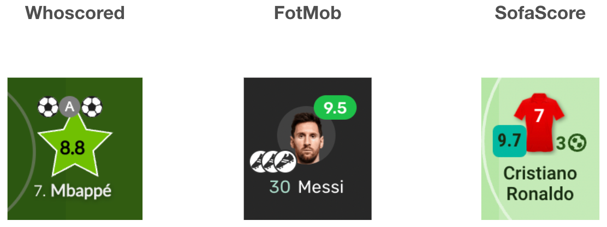
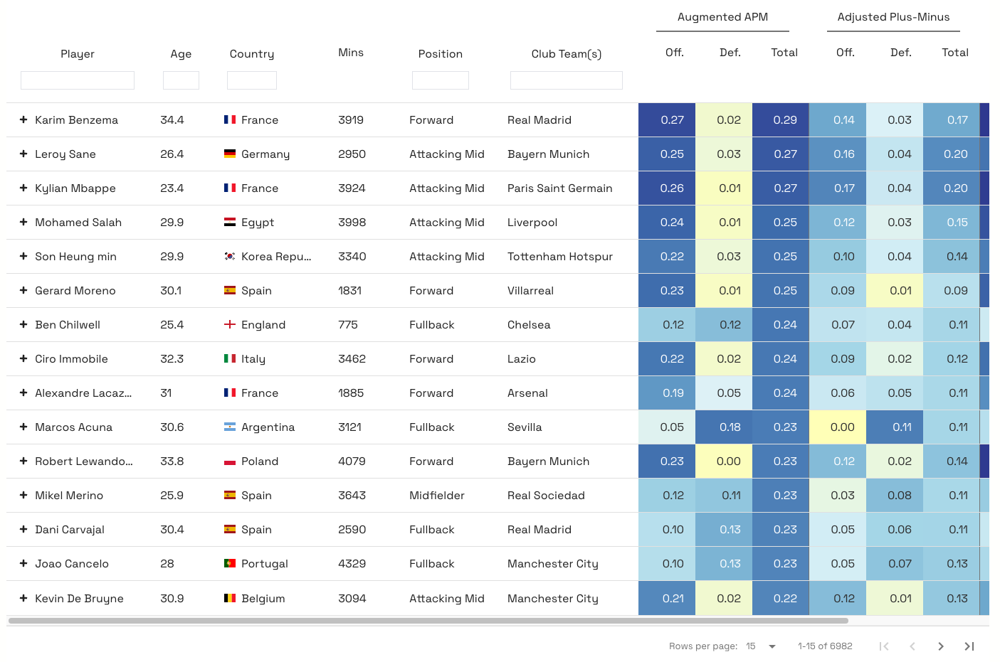
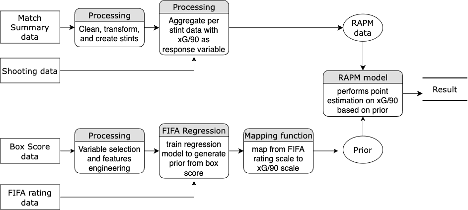
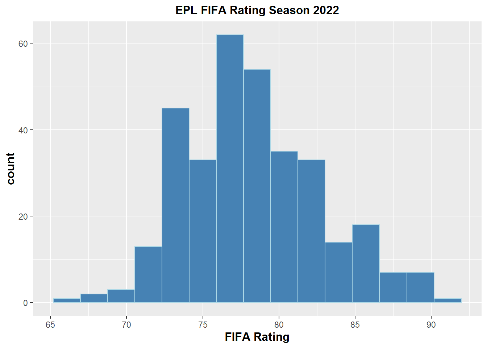
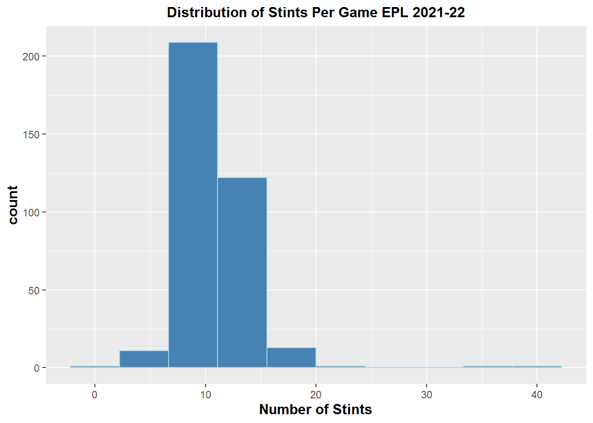
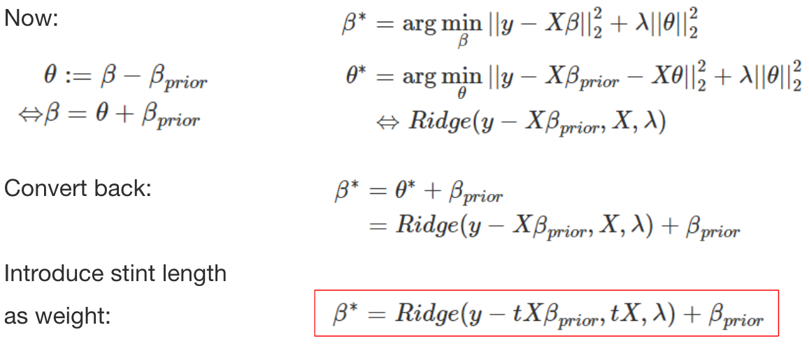
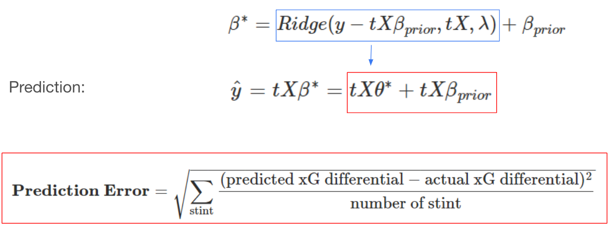
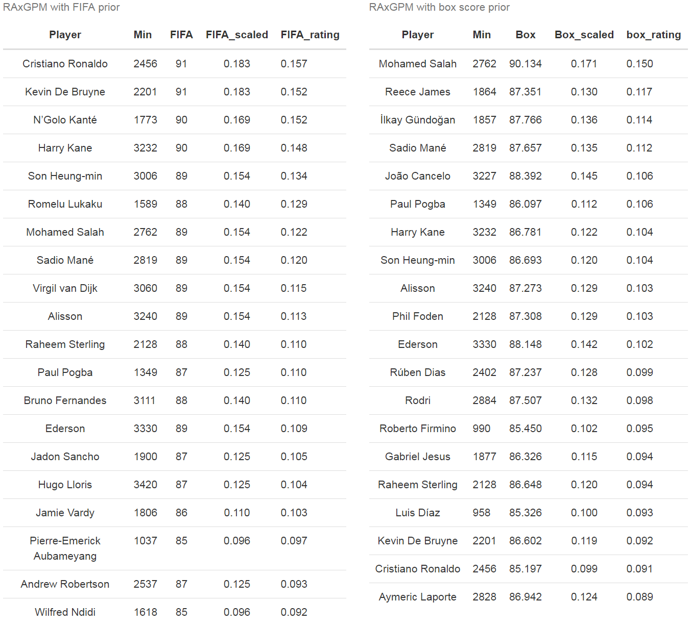

```{r setup, include=FALSE}
options(htmltools.dir.version = FALSE)
knitr::opts_chunk$set(
  fig.width=9, fig.height=3.5, fig.retina=3,
  out.width = "100%",
  cache = FALSE,
  echo = TRUE,
  message = FALSE, 
  warning = FALSE,
  hiline = TRUE
)
```

```{r xaringan-themer, include=FALSE, warning=FALSE}
library(xaringanthemer)
style_duo_accent(
  primary_color = "#57068c",
  secondary_color = "#8900e1",
  inverse_header_color = "#FFFFFF"
)
```

class: inverse center middle

# How to evaluate the impact of individual players on their team’s performance?

---

# Plus-Minus (+/-) Model 

## Concept:

keeps track of the net changes in the score when a given player is either on or off the court

## Formula:

.center[**Plus-Minus for Any Player = (Team Points Scored - Team Points Allowed) While That Player is On The Court**]

## Benefits:

  - Identify a player’s implied effect on his team’s goal difference while he is on the field
  - Data required to compute Plus-Minus are already available: only need the player lineups and substitutions records with the times at which they occurred, and goals scored and their corresponding times
  - Could be employed in any league, on any match, at any time

## Problems:
  - A player’s effect on his team’s goal differential will change as the makeup of teammates and opponents changes during the game

---

# Adjusted Plus-Minus (APM) Model

## Concept:

Over a given time period, adjusting the basic plus-minus results to account for both the teammates and the opponents on the court.

## Formula:

$$\frac{T_{total}}{T_{j}} \Delta S = \beta_0 + \beta_1x_1 + \beta_2x_2 + \cdots + \beta_ix_i + \cdots + \beta_nx_n + \epsilon$$
  - $\Delta S$: Score differential, $S_{home} - S_{away}$
  - $T_j$: Length of time segment, the interval in which no substitutions or expulsions occurred, for $j = 1, \dots, R$ segments
  - $\beta_0$: Average home team advantage over all teams in the competition
  - $\beta_i$: Influence of player $i$ on goal differential, for $i = 1, \dots, N$ players in competition
  - $x_i$: Player appearance index:
    - +1: Player $i$ is playing at home
    - 0: Player $i$ is not playing
    - -1: Player $i$ is playing away

---

# Adjusted Plus-Minus (APM) Model

$$\beta^* = \arg \min_{\beta} ||\Delta S - tX\beta||_2^2$$

## Interpretation:
APM ratings indicate how many additional points are contributed to a team’s scoring margin by a given player in comparison to the league-average player whose APM value is zero over the span of a typical game.

## Benefits:

  - Reflects the impact of each player on his team’s scoring margin after controlling for the strength of every teammate and every opponent during each minute he’s on the court

## Problems:
  - High variance, overfitting, and sensitive to the noise
  - Multicollinearity: Coaches prefer to use some groups of players more frequently or rarely since all players could not be on the court with every other teammate at the same time

---

# Regularized Adjusted Plus-Minus (RAPM) Model

## Concept:

Adding regularization into APM model to improve model accuracy.

## Formula:

$$\beta^* = \arg \min_{\beta} ||\Delta S - tX\beta||_2^2 + \lambda||\beta||_2^2$$

## Benefits:

  - Significantly reduces standard errors in APM model and provide more accurate prediction results

## Problems:

  - Multicollinearity: Coaches prefer to use some groups of players more frequently or rarely since all players could not be on the court with every other teammate at the same time

---

# Problematic Nature of Soccer

```{r scoring_vs_subs, eval=TRUE, out.width="50%", out.height="50%", fig.align = 'center', warning=FALSE, message=FALSE, echo=FALSE}
knitr::include_graphics("https://www.intraocular.net/posts/how-augmented-apm-works/scoring_vs_subs_sports-1.png")
```

--

- Low number of substitutions $\Longrightarrow$ multicollinearity between features
- Low number of scoring $\Longrightarrow$ sparse response variable

---

# Current State of Socceer Player Rating

## Player ratings based on actions in a game

.center[]

---

# Current State of Socceer Player Rating

## Video game player ratings

.center[]

---

# Current State of Socceer Player Rating

Matano, F., L. F. Richardson, T. Pospisil, C. Eubanks, and J. Qin (2018): “[`Augmenting Adjusted Plus-Minus in Soccer with FIFA Ratings`](https://arxiv.org/abs/1810.08032),” _Carnegie Mellon Sports Analytics Conference_.

- Recasting APM into a Bayesian framework, and incorporating FIFA ratings into the prior distribution
- Shown that Argumented APM predicts better than standard APM and a model using only FIFA ratings
- Shown that Agumented APM decorrelates players that are highly collinear

```{r augumented_apm, eval=TRUE, out.width="50%", out.height="50%", fig.align = 'center', warning=FALSE, message=FALSE, echo=FALSE}

```

---

# Model Structure

.center[]

---

class: inverse center middle

# Example: English Premier League 2021-22 Season

---

# Data: Prior Stage

## Box Score Data: EPL season 2020-21 and 2021-22
- 3,420 observations and more than 180 features
- only consider player with 900 minutes and above in corresponding season
- after variable selection, around 30 features are left including the following criteria: 
  - Scoring, creating, dribbling, passing and defensive actions, etc.

## FIFA Ratings 2022 Data: before starts of 2021-22 season
- only collected one overall rating for each unique player

---

# Data: Prior Stage

## FIFA Ratings 2022 Data: before starts of 2021-22 season

```{r fifa_rating_distribution, eval=TRUE, out.width="60%", out.height="60%", fig.align = 'center', warning=FALSE, message=FALSE, echo=FALSE}

```

---

# Data: RAPM Stage

## Match Summary data: EPL season 2021-22
  - collected line-ups, substitutions, and every events for every game
  - create stint with time start and length: 
    - a stint is created when there is a substitution, a red card, or a goal happens
  - 4000 stints over 380 matches

## Shooting Data: EPL season 2021-22
  - collected shooting information with corresponding expected goals for every shot in the season

---

# Data: RAPM Stage

## Match Summary data: EPL season 2021-22

```{r stint_distribution, eval=TRUE, out.width="60%", out.height="60%", fig.align = 'center', warning=FALSE, message=FALSE, echo=FALSE}

```

---

# Data: RAPM Stage

.center[]

---

# Model Training

.center[]

---

# Model Training

.center[]

---

# Model Testing: Predictability

.center[]

---

# Model Testing: Predictability

10-fold cross-validation with accuracy measured by RMSE:
  - **RAPM_only**: RAPM model without any prior
  - **RAPM_FIFA**: RAPM model with FIFA rating directly as prior
  - **RAPM_box**: RAPM model with prior created from box score data

```{r comparison_result, eval=TRUE, out.width="50%", out.height="50%", fig.align = 'center', warning=FALSE, message=FALSE, echo=FALSE}
knitr::include_graphics("image/comparison_result.png")
```

---

# Model Testing: Interpretability

```{r result_table, eval=TRUE, out.width="58%", out.height="58%", fig.align = 'center', warning=FALSE, message=FALSE, echo=FALSE}

```

---

# Conclusion

- This project introduces a new kind of **Regularized Adjusted Expected Goal Plus-Minus model (RAxGPM)** in soccer to evaluate players’ performance and contribution, in which we incorporate **priors generated from box-score data** into a regularized regression framework. We’ve also decided to use **expected goals differential per 90** as the response variable in order to increase the predictability of our model and have a more frequent response variable compared to actual goals.

- Unlike previous work that has employed a Bayesian framework, our model is only performing a **point estimation** on the response variable through a regularized linear model with a prior, which does not require any assumption on the prior distribution.

- We have also shown that the RAxGPM model with the prior we created from box score data has **better out-of-sample prediction accuracy** than the RAxGPM model with FIFA rating as prior, and without any prior, which proves that by incorporating box score data, we are indeed adding more valuable information to our model.

---

# Discussion

##Future Work

- adding more data, increasing sample size to enhance model training and prediction accuracy
- employing more supervised learning techniques to increase prior model quality
- bagging to improve the stability and the accuracy of RAxGPM model
- choice of response variable: could we find a better measurement for soccer?
- implementing tracking data to build a more comprehensive model
- constructing Bayesian framework to add uncertainty to the model through distribution

## Applications

- predicting player’s market value and salary
- optimal line-up recommendation
- predicting game results and simulating league result
- evaluating players across different leagues

---

# References

- Hvattum, L. (2019). A comprehensive review of plus-minus ratings for evaluating individual players in team sports. International Journal of Computer Science in Sport.

- Matano, F., Richardson, L. F., Pospisil, T., Eubanks, C., & Qin, J. (2018). Augmenting adjusted plus-minus in soccer with FIFA ratings. arXiv preprint arXiv:1810.08032.

- Rosenbaum, D. T. (2004, April 30). Picking the difference makers for the All-NBA Teams. 82games.com. Retrieved July 28, 2022, from https://www.82games.com/comm30.html

- Sill, J. (2010). Improved NBA adjusted+/-using regularization and out-of-sample testing. In Proceedings of the 2010 MIT Sloan Sports Analytics Conference.

- Zhang, B., Tran Hoac, E., Hoang P. (2022). A RAPM Model for Soccer Player Ratings. https://www.stat.cmu.edu/cmsac/sure/2022/showcase/soccer_rapm.html

---

class: inverse center middle

# Thanks!
